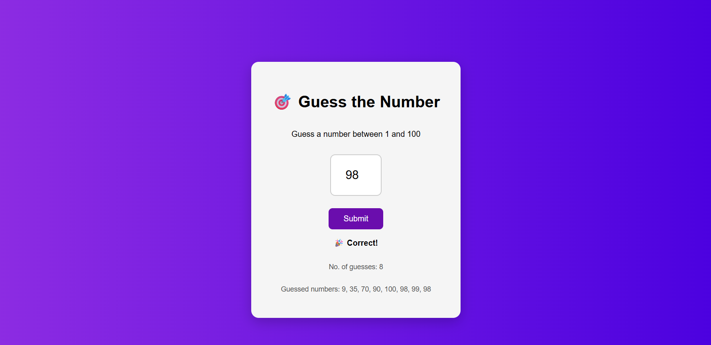

# 🎯 Number Guessing Game

A responsive and interactive Number Guessing Game built using HTML, CSS, and JavaScript.

## 🚀 Features
- 🎲 Random number generation
- 🔍 Real-time feedback (Too High / Too Low)
- 📊 Tracks number of attempts
- 📝 Displays guess history
- 🎨 Clean and modern UI

## 🛠️ Tech Stack
- HTML
- CSS
- JavaScript

## 📸 Preview

## 🌐 Live Demo
[Click here to play the game]
https://samruddhigore-dev.github.io/guessing-game/

## 📌 How to Run
1. Download the project
2. Open `index.html` in your browser

---

✨ This project demonstrates core front-end development skills including DOM manipulation, event handling, and UI design.
